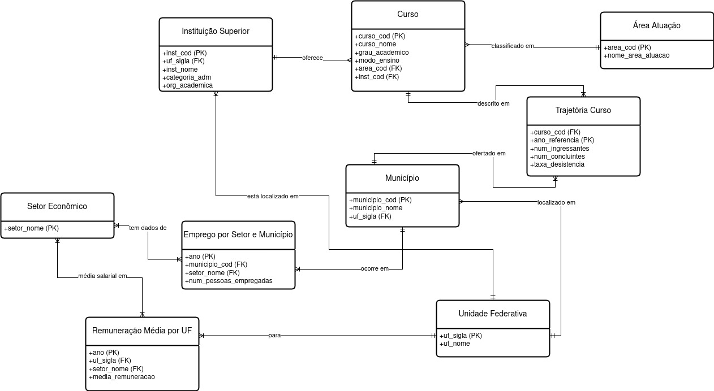
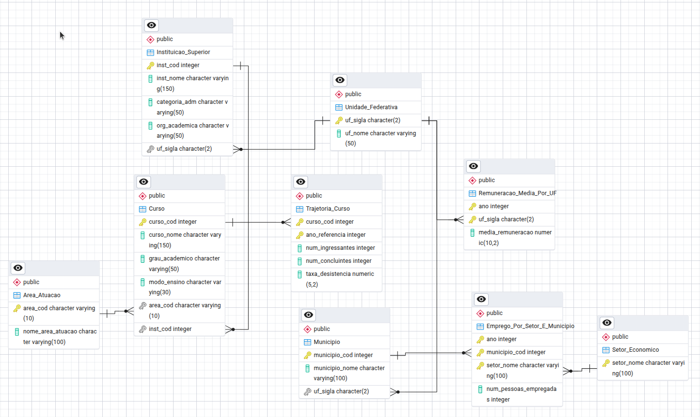

# Projeto de MC536 - Análise de Concluintes do Ensino Superior e Mercado de Trabalho
### Grupo ID 22

## 👥 Integrantes:  
&nbsp;&nbsp;&nbsp;Maria Gabriela Lustosa Oliveira - RA: 188504  
&nbsp;&nbsp;&nbsp;Gabriel Cabral Romero Oliveira - RA: 247700  
&nbsp;&nbsp;&nbsp;Flavia Juliana Ventilari dos Santos - RA: 260438     


## 📁 Overview dos Arquivos

- [Descrição do Projeto](#descrica-do-projeto)
- [Esquema dos Databases](#esquema-dos-databases)
- [Datasets](#datasets)
- [Organização do Projeto](#Organização-do-projeto)
- [Executando o Projeto](#executando-o-projeto)
- [Queries](#queries)


## 🎯 Objetivo do Projeto

Este projeto tem como objetivo investigar a relação entre formandos e ingressantes no ensino superior por área de atuação e o crescimento econômico dessas mesmas áreas no período de 2020 a 2023. A análise é realizada com base em Unidade Federativa (UF), município e ano, buscando compreender como estudantes de graduação percebem o mercado de trabalho e de que forma transformações econômicas em determinados setores impactam a escolha de cursos e a formação profissional.

A proposta foi desenvolvida à luz dos Objetivos de Desenvolvimento Sustentável (ODS) da ONU, especialmente:

- ODS 4 – Educação de Qualidade

    4.3: Aumentar o acesso igualitário ao ensino técnico, profissional e superior

    4.4: Aumentar o número de jovens e adultos com competências relevantes para o emprego

- ODS 8 – Trabalho Decente e Crescimento Econômico

    8.5: Alcançar emprego pleno e produtivo para todos

    8.6: Reduzir a proporção de jovens sem emprego, educação ou formação

Ao alinhar a análise de dados educacionais e econômicos com esses objetivos globais, o projeto busca contribuir para uma compreensão mais profunda das interações entre formação acadêmica e desenvolvimento do mercado de trabalho no Brasil.

## 🧠 Modelagem Conceitual



## 🧠 Modelagem Relacional


## 🧠 Modelagem Física
[Script de geração do banco diretamente em SQL](models/physical_model.sql)

## 📊 Datasets Utilizados

Este projeto utiliza dados provenientes de duas principais fontes públicas nacionais: RAIS (Relação Anual de Informações Sociais) e Censo da Educação Superior (Inep), abrangendo o período de 2019 a 2023. Os dados foram selecionados e organizados de modo a possibilitar análises combinadas entre mercado de trabalho e formação acadêmica no Brasil.

**RAIS (2020-2023)**
Foram utilizadas informações da RAIS, com ênfase nos seguintes arquivos:

- Tabela 4: Número de empregos formais e sua variação por cidade do país
    
    

- Tabela 6: Remuneração média por área de atuação e por estado
    
    

Esses dados fornecem uma visão abrangente do comportamento do mercado de trabalho brasileiro nos últimos anos.

****
A base de dados do Censo da Educação Superior abrange os anos de 2019 a 2023 e contém informações detalhadas sobre:

- Cursos oferecidos por instituições de ensino superior em todo o país

- Classificação dos cursos por grandes áreas de atuação

- Possibilidade de segmentação por Unidade Federativa (UF) e ano

Esses dados permitem associar a formação dos alunos com o contexto econômico e as demandas do mercado em cada região do Brasil.

## 🗂️ Estrutura do Repositório

```
📦 PROJETO_MCS36
├── 📁 datasets
│   ├── indicadores_educacao.csv
│   ├── rais_tabela4_2021.csv
│   ├── rais_tabela4_2023.csv
│   ├── rais_tabela4_joined.csv
│   ├── rais_tabela6_2021.csv
│   ├── rais_tabela6_2023.csv
│   └── rais_tabela6_joined.csv
├── 📁 models
│   ├── conceptual_model.png
│   ├── physical_model.sql
│   └── relational_model.png
├── 📁 preprocessed_dataset
│   ├── indicadores_trajetoria_educacao_superior.csv
│   ├── RAIS_ano_base_2021_TABELA4.csv
│   ├── RAIS_ano_base_2021_TABELA6.csv
│   ├── RAIS_ano_base_2023_TABELA4.csv
│   └── RAIS_ano_base_2023_TABELA6.csv
├── 📁 python_files
│   ├── create_database.py
│   ├── fill_database.py
│   ├── process_datasets.py
│   └── run_queries.py
└── 📁 queries
    ├── query_1_result.csv
    ├── query_2_result.csv
    ├── query_3_result.csv
    ├── query_4_result.csv
    └── query_5_result.csv
```

## 🛠️ Tecnologias Utilizadas
**Banco de Dados:** PostgreSQL

**Linguagem de Programação:** Python 3.12

**Bibliotecas Python:**

    pandas: Manipulação e análise de dados

    psycopg2-binary: Conexão com o PostgreSQL

    sqlalchemy: Toolkit SQL para Python

    tqdm: Barra de progresso para loops

**Ferramentas:**

    pgAdmin: Administração do banco de dados PostgreSQL
    

## ⚙️ Como Executar o Projeto

**Scripts:**
1. Clonar o Repositório
   ```
    git clone https://github.com/mariagabi-lustosa/projeto_MC536.git
    cd projeto_MC536
   ```
   
2. Criar e Ativar um Ambiente Virtual (Opcional, mas recomendado)

    ```
    python -m venv venv
    source venv/bin/activate  # No Windows: venv\Scripts\activate
    ```

3. Instalar as Dependências
    ```
    pip install -r requirements.txt
    ```

4. Configurar o Banco de Dados

Certifique-se de que o PostgreSQL está instalado e em execução.

Crie um banco de dados chamado mc536_project (ou outro nome de sua preferência).

Atualize as credenciais de acesso ao banco de dados nos scripts Python conforme necessário.

5. Executar os Scripts Python

Navegue até a pasta `python_files/`.

Execute os scripts na ordem apropriada para carregar os dados, realizar análises e gerar resultados.

6. Executar as Consultas SQL

As consultas SQL estão localizadas na pasta `queries/`.

Utilize o pgAdmin ou outro cliente SQL para executar as consultas no banco de dados.

## 📈 Queries

 *Identifica os 20 municípios com mais empregos formais em um setor e ano específicos* 

 *Relação entre taxa de desistência média e variação de remuneração por área do conhecimento em um determinado período de tempo*  

 *Relação entre estados com queda na remuneração e taxa de desistência média dos cursos de graduação*  

 *Relação entre estados com aumento de remuneração e taxa de desistência média dos cursos de graduação*  

 *Partindo de um ano de referência, identifica quantos foram os ingressantes de uma determinada área em uma instituição específica*  

### 📄 Licença
Este projeto é de uso acadêmico e está sujeito às diretrizes da disciplina MC536 da Unicamp oferecida no primeiro semestre de 2025.
