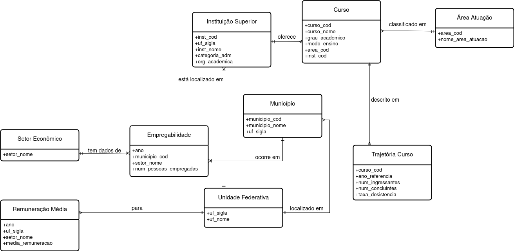

### projeto_MC536

### Membros:  
&nbsp;&nbsp;&nbsp;Maria Gabriela Lustosa de Oliveira - RA:83183901  
&nbsp;&nbsp;&nbsp;Gabriel Cabra; - RA:83183901  
&nbsp;&nbsp;&nbsp;Flavia Juliana Ventilari dos Santos - RA: 260438  

### Glossário

## [Descrição do Projeto](#descrica-do-projeto)
## [Esquema dos Databases](#esquema-dos-databases)
## [Datasets](#datasets)
## [Tecnologias Ultilizadas](#linguagens-ultilizadas)
## [Organização do Projeto](#Organização-do-projeto)
## [Data Processing](#data-processing)
## [Queries](#queries)

### Descrição do Projeto

Nosso projeto para a disciplica MC536 - Banco de Dados visa estabelecer uma ligação entre os dados de conluintes do ensino superior no Brasil em determinada área do conhecimento, e os dados referentes as ofertas de emprego para essas áreas, analisando os dados com base em UF, Município e >>>.

### Descrição dos Databases

## [Modelo Físico:](models/physical_model.sql)

### Tecnologias Ultilizadas

**DataBase**:PostgreSQL 
**Linguagem**: Python
**Bibliotecas**: panda, sql ect etc deps vejo

## Organização do Projeto

