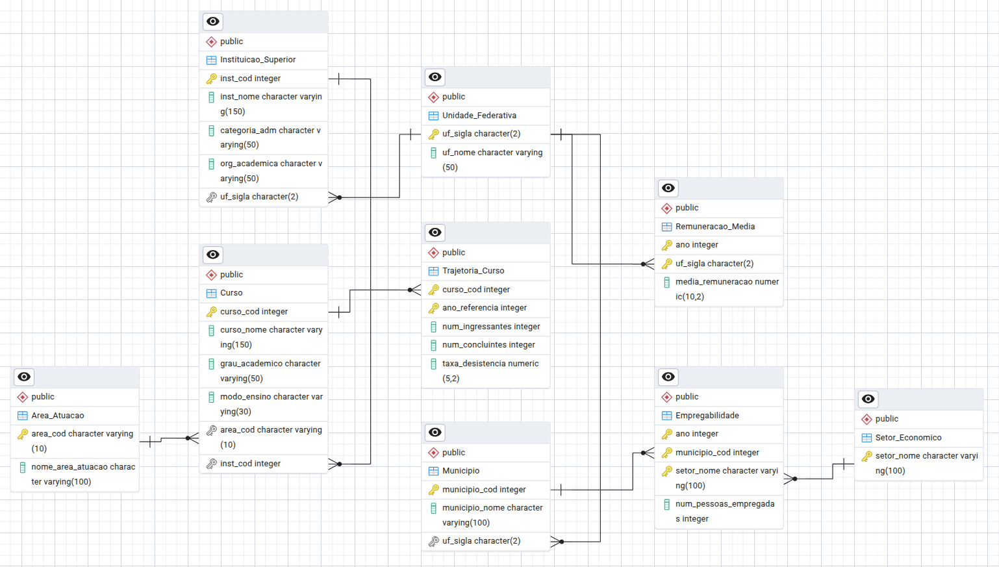

# Projeto de MC536 - Análise de Concluintes do Ensino Superior e Mercado de Trabalho

## 👥 Integrantes (ID 22):  
   Maria Gabriela Lustosa Oliveira - RA: 188504  
   Gabriel Cabral Romero Oliveira - RA: 247700  
   Flavia Juliana Ventilari dos Santos - RA: 260438     


## 📁 Overview do Repositório

- [Objetivo do Projeto](#Objetivo-do-Projeto)
- [Modelos](#Modelos)
- [Datasets Utilizados](#Datasets-Utilizados)
- [Estrutura do Repositório](#Estrutura-do-Repositório)
- [Tecnologias Utilizadas](#Tecnologias-Utilizadas)
- [Como Executar o Projeto](#Como-Executar-o-Projeto)
- [Resultado das Queries](#Resultado-das-Queries)

## 🎯 Objetivo do Projeto

Este projeto tem como objetivo investigar a relação entre formandos e ingressantes no ensino superior por área de atuação e o crescimento econômico dessas mesmas áreas no período de 2020 a 2023. A análise é realizada com base em Unidade Federativa (UF), município e ano, buscando compreender como estudantes de graduação percebem o mercado de trabalho e de que forma transformações econômicas em determinados setores impactam a escolha de cursos e a formação profissional.

A proposta foi desenvolvida à luz dos Objetivos de Desenvolvimento Sustentável (ODS) da ONU, especialmente:

- ODS 4 – Educação de Qualidade

    4.3: Aumentar o acesso igualitário ao ensino técnico, profissional e superior

    4.4: Aumentar o número de jovens e adultos com competências relevantes para o emprego

- ODS 8 – Trabalho Decente e Crescimento Econômico

    8.5: Alcançar emprego pleno e produtivo para todos

    8.6: Reduzir a proporção de jovens sem emprego, educação ou formação

Ao alinhar a análise de dados educacionais e econômicos com esses objetivos globais, o projeto busca contribuir para uma compreensão mais profunda das interações entre formação acadêmica e desenvolvimento do mercado de trabalho no Brasil.

## 🧠 Modelos

### Modelagem Conceitual


### Modelagem Relacional


### Modelagem Física
[Script de geração do banco diretamente em SQL](models/physical_model.sql)

## 📊 Datasets Utilizados

Este projeto utiliza dados provenientes de duas principais fontes públicas nacionais: RAIS (Relação Anual de Informações Sociais) e Censo da Educação Superior (Inep), abrangendo o período de 2020 a 2023. Os dados foram selecionados e organizados de modo a possibilitar análises combinadas entre mercado de trabalho e formação acadêmica no Brasil.

### RAIS (2020-2023)
Foram utilizadas informações da RAIS, com ênfase nos seguintes arquivos:

- Tabela 4: Número de empregos formais e sua variação por cidade do país
    - 
    - 

- Tabela 6: Remuneração média por área de atuação e por estado
    - 
    - 

Esses dados fornecem uma visão abrangente do comportamento do mercado de trabalho brasileiro nos últimos anos.

---

### 
A base de dados do Censo da Educação Superior abrange os anos de 2019 a 2023 e contém informações detalhadas sobre:

- Cursos oferecidos por instituições de ensino superior em todo o país

- Classificação dos cursos por grandes áreas de atuação

- Possibilidade de segmentação por Unidade Federativa (UF) e ano

Esses dados permitem associar a formação dos alunos com o contexto econômico e as demandas do mercado em cada região do Brasil.

## 🗂️ Estrutura do Repositório

```
📦 PROJETO_MCS36
├── 📁 datasets
│   ├── indicadores_educacao.csv
│   ├── rais_tabela4_2021.csv
│   ├── rais_tabela4_2023.csv
│   ├── rais_tabela4_joined.csv
│   ├── rais_tabela6_2021.csv
│   ├── rais_tabela6_2023.csv
│   └── rais_tabela6_joined.csv
├── 📁 models
│   ├── conceptual_model.png
│   ├── physical_model.sql
│   └── relational_model.png
├── 📁 preprocessed_dataset
│   ├── indicadores_trajetoria_educacao_superior.csv
│   ├── RAIS_ano_base_2021_TABELA4.csv
│   ├── RAIS_ano_base_2021_TABELA6.csv
│   ├── RAIS_ano_base_2023_TABELA4.csv
│   └── RAIS_ano_base_2023_TABELA6.csv
├── 📁 python_files
│   ├── create_database.py
│   ├── fill_database.py
│   ├── process_datasets.py
│   └── run_queries.py
└── 📁 queries
    ├── query_1_result.csv
    ├── query_2_result.csv
    ├── query_3_result.csv
    ├── query_4_result.csv
    └── query_5_result.csv
```

## 🛠️ Tecnologias Utilizadas
**Banco de Dados:** `PostgreSQL==17.4`

**Linguagem de Programação:** `python==3.12.7`

**Bibliotecas Python:**
```
pandas==2.2.3: Manipulação e análise de dados
numpy==2.2.5
psycopg2-binary==2.9.10
argparse==1.1
rapidfuzz==3.13.0
```
    
**Ferramentas:** `PgAdmin4==9.2: Administração do banco de dados PostgreSQL`
    
## ⚙️ Como Executar o Projeto

**Scripts:**
1. Clonar o Repositório
   ```
    git clone https://github.com/mariagabi-lustosa/projeto_MC536.git
    cd projeto_MC536
   ```
   
2. Criar e Ativar um Ambiente Virtual (Opcional, mas recomendado)

    ```
    python -m venv venv
    source venv/bin/activate
    ```

3. Instalar as Dependências
    ```
    pip install -r requirements.txt
    ```

4. Configurar o Banco de Dados

Certifique-se de que o PostgreSQL está instalado e em execução.

Crie um banco de dados chamado mc536_project (ou outro nome de sua preferência).

Atualize as credenciais de acesso ao banco de dados nos scripts Python conforme necessário.

5. Executar os Scripts Python

Navegue até a pasta `python_files/`. Ela contém os scripts principais para processamento, criação, população e consulta ao banco de dados do projeto.
Abaixo estão os arquivos organizados na ordem recomendada de execução, com suas respectivas funções:
<details> <summary> Clique para expandir a descrição dos scripts</summary>
    
1. `process_datasets.py`
Realiza o pré-processamento e a consolidação dos arquivos CSV brutos do projeto (Inep e RAIS).
Gera os arquivos a seguir, que são posteriormente utilizados para popular o banco:
    indicadores_educacao.csv
    rais_tabela4_joined.csv
    rais_tabela6_joined.csv
    
    ```
    python process_datasets.py -i <caminho_csv_inep> -r4 <rais_tabela4.csv> -r6 <rais_tabela6.csv> -b4 True -b6 True -o <diretorio_saida>
    ```

2. `create_database.py`
Cria o esquema relacional no PostgreSQL com todas as tabelas e restrições de integridade (chaves primárias e estrangeiras).
```
python create_database.py -c True
```

3. `fill_database.py`
Insere os dados processados no banco de dados. Utiliza os arquivos gerados no passo 1.

```
python fill_database.py -d <diretorio_com_csvs_processados>
```

4. `run_queries.py`
Executa 5 consultas analíticas não triviais sobre o banco de dados, salvando os resultados em arquivos CSV (`query_1_result.csv`, `query_2_result.csv` etc.).
As consultas abordam, por exemplo:
- Correlação entre taxa de desistência e remuneração
- Municípios com maior número de empregos formais
- Análise de áreas com aumento ou queda na remuneração
- Quantidade de ingressantes por área e instituição
  
```
python run_queries.py
```

**⚠️ Importante:** Antes de executar os scripts, certifique-se de configurar corretamente os parâmetros de conexão com o banco de dados PostgreSQL (`dbname`, `user`, `password`, `host`, `port`) nos arquivos .py.
</details>

6. Executar as Consultas SQL

As consultas SQL estão localizadas na pasta `queries/`.

Utilize o pgAdmin ou outro cliente SQL para executar as consultas no banco de dados.

## 📈  Resultado das Queries

 *Identifica os 20 municípios com mais empregos formais em um setor e ano específicos* 

 *Relação entre taxa de desistência média e variação de remuneração por área do conhecimento em um determinado período de tempo*  

 *Relação entre estados com queda na remuneração e taxa de desistência média dos cursos de graduação*  

 *Relação entre estados com aumento de remuneração e taxa de desistência média dos cursos de graduação*  

 *Partindo de um ano de referência, identifica quantos foram os ingressantes de uma determinada área em uma instituição específica*  

### 📄 Licença
Este projeto é de uso acadêmico e está sujeito às diretrizes da disciplina MC536 da Unicamp oferecida no primeiro semestre de 2025.
